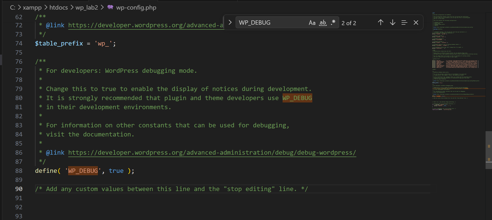
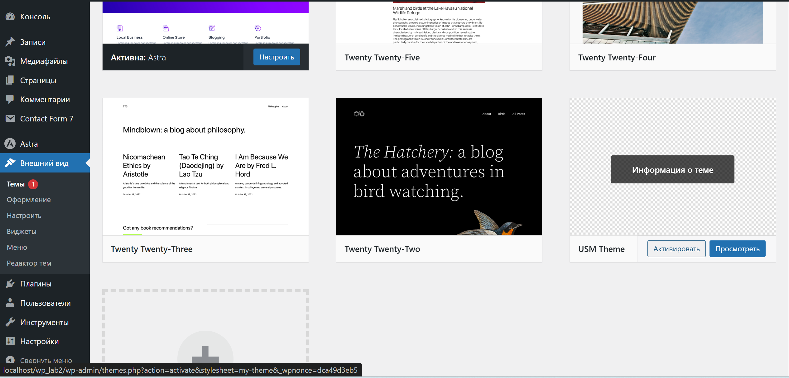
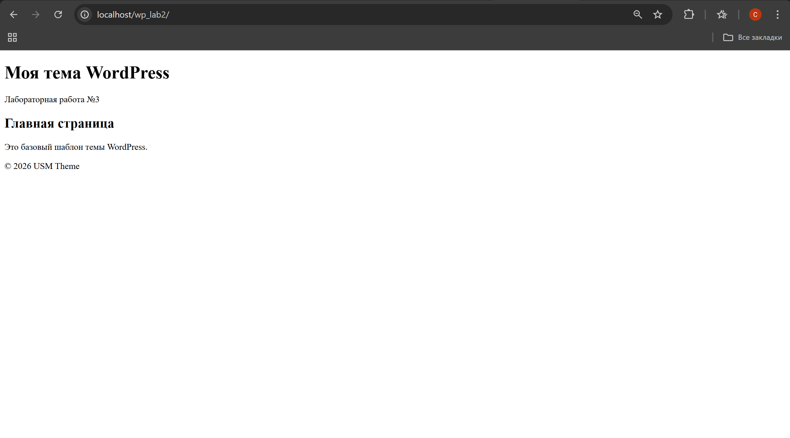
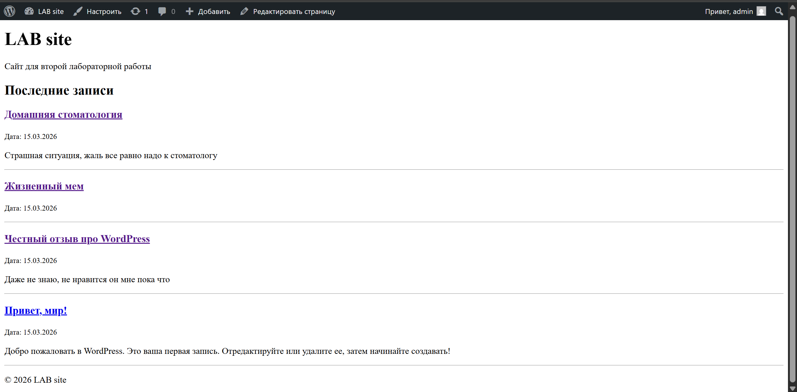
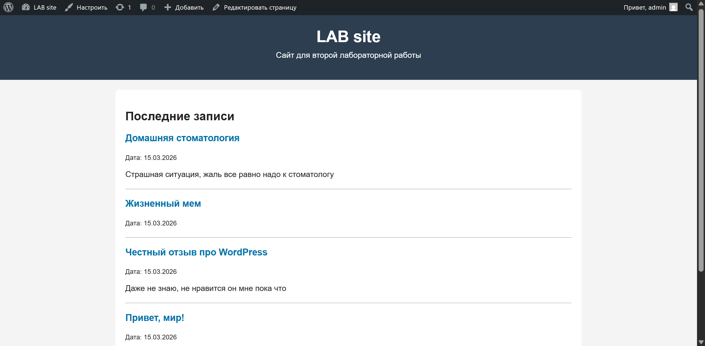
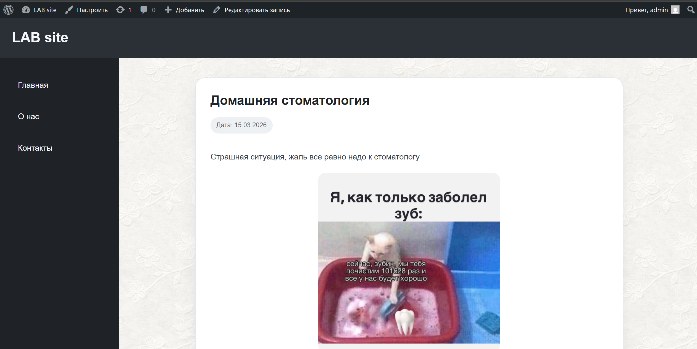
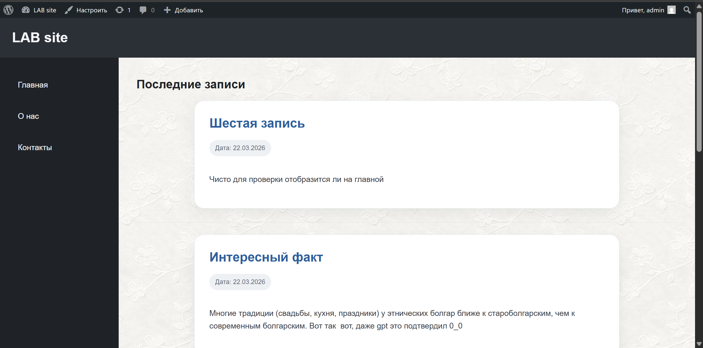
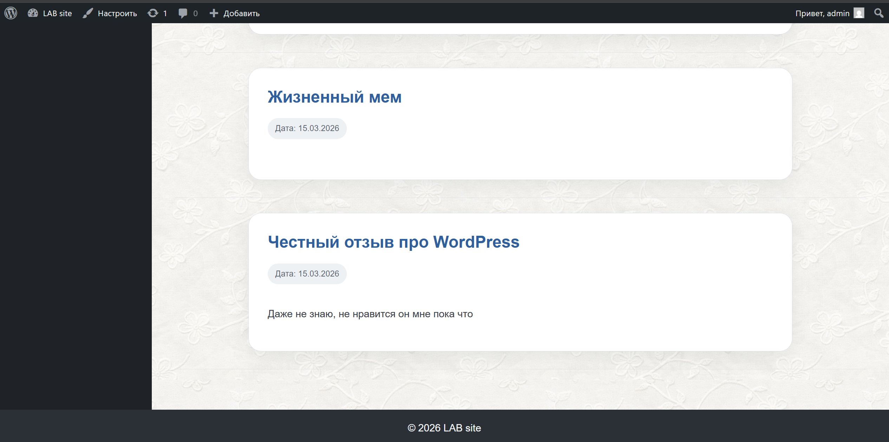
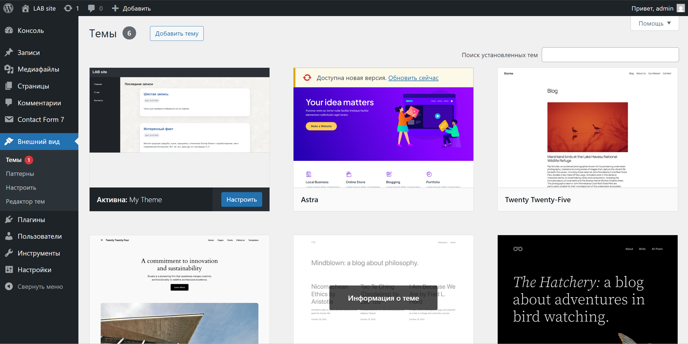

# Лабораторная работа №3. Разработка простой темы WordPress

 - **Калинкова София, I2302** 
 - **20.03.2026** 

## Цель работы

Научиться создавать собственную тему WordPress, разобраться в её минимальной структуре и принципах работы шаблонов.

## Условие

### Шаг 1. Подготовка среды

1. В локальной установке WordPress перешла в папку `wp-content/themes`.
2. Создала директорию для своей темы, `my-theme`.
3. Включила отладку в `wp-config.php`, установив `define('WP_DEBUG', true);`.

`define('WP_DEBUG', true);` позволяет отслеживать возможные ошибки при разработке и тестировании темы.

### Шаг 2. Создание обязательных файлов темы

1. В папке темы создала файл [style.css](my-theme/style.css) с метаданными темы.
2. После метаданных добавила базовые CSS-правила.
3. Создала файл [index.php](my-theme/index.php) - главный шаблон темы. Для начала и добавила в него базовую HTML-структуру.

4. Проверила, что тема появилась, активировала

### Шаг 3. Общие части шаблонов

1. Создала файл [header.php](my-theme/header.php) и перенесла туда код шапки сайта.
2. Создала файл [footer.php](my-theme/footer.php) и перенесла туда код подвала сайта.
3. В [index.php](my-theme/index.php) подключила `header.php` и `footer.php` с помощью функций `get_header()` и `get_footer()`.
4. На главной странице вывела список последних записей (_5 штук_) с помощью цикла WordPress.

### Шаг 4. Файл функций

1. Создала файл [functions.php](my-theme/functions.php) в папке темы.
2. В `functions.php` добавила функцию для подключения стилей темы с помощью `wp_enqueue_style()`.

### Шаг 5. Дополнительные шаблоны

1. Создала файл [single.php](my-theme/single.php) для отображения отдельного поста.
2. Создала файл [page.php](my-theme/page.php) для отображения страниц.
3. Создала файл [sidebar.php](my-theme/page.php) для боковой панели и подключите его в нужных шаблонах с помощью `get_sidлаr()`.
4. Создала файл [comments.php](my-theme/comments.php) для отображения комментариев и подключите его в `single.php` и `page.phла
5. Создала файл [archive.php](my-theme/archive.php) для отображения архивов записей.

### Шаг 6. Стилизация темы

Добавила стили для основных элементов темы (шапка, подвал, контент, боковая панель).

### Шаг 7. Скриншот темы

Добавила в папку темы файл [screenshot.png](my-theme/screenshot.png) - изображение-превью темы (размер 1200x900px).

### Шаг 8. Активация темы

1. В админ-панели WordPress перешла в раздел Appearance → Themes.
2. Нашла свою тему и активировала её.
3. Проверила, что сайт с темой отображается нормально.

## Контрольные вопросы

### 1. Какие два файла являются обязательными для любой темы WordPress?

Обязательными файлами темы WordPress являются:

* `style.css` — содержит метаданные темы и стили оформления;
* `index.php` — основной шаблон, который используется для отображения страниц, если отсутствуют другие шаблоны.

### 2. Как подключаются общие части шаблонов (header, footer, sidebar)?

Общие части шаблонов подключаются с помощью специальных функций WordPress:

* `get_header();` — подключает файл `header.php`;
* `get_footer();` — подключает файл `footer.php`;
* `get_sidebar();` — подключает файл `sidebar.php`.

Эти функции позволяют повторно использовать одинаковые части интерфейса на разных страницах.

### 3. Чем отличаются `index.php`, `single.php` и `page.php`?

* `index.php` — основной универсальный шаблон темы, используется по умолчанию для отображения страниц и списка записей;
* `single.php` — используется для отображения отдельной записи (поста);
* `page.php` — используется для отображения статических страниц (например, «О нас», «Контакты»).

### 4. Зачем нужен файл `functions.php` в теме?

Файл `functions.php` используется для добавления функциональности темы.
С его помощью можно:

* подключать стили и скрипты (`wp_enqueue_style`, `wp_enqueue_script`);
* добавлять поддержку возможностей WordPress (например, `add_theme_support`);
* регистрировать меню и виджеты;
* расширять поведение темы с помощью пользовательских функций.

## Вывод

 В ходе работы была создана простая тема WordPress и изучена её структура. Были освоены основные шаблоны, способы подключения стилей и организация отображения контента. Полученные знания позволяют разрабатывать собственные темы и настраивать внешний вид сайтов на WordPress.

## Список использованных источников

1. [Лучший курс по WordPress](https://github.com/MSU-Courses/content-management-systems/tree/main)
2. [Официальная документация WordPress (Theme Handbook)](https://developer.wordpress.org/themes/)

3. [WordPress Codex (документация по функциям и шаблонам)](https://codex.wordpress.org/)
  
4. [Хабр — разработка тем WordPress](https://habr.com/ru/articles/)