# Лабораторная работа №4. Разработка плагина для WordPress

 - **Калинкова София, I2302** 
 - **27.03.2026** 

## Цель работы

Освоить расширяемую модель данных WordPress: создать CPT (Custom Post Type), пользовательскую таксономию, метаданные с метабоксом в админ-панели, а также реализовать виджет для отображения данных на сайте.

## Условие

Соберать учебный плагин USM Notes, который добавляет в сайт раздел «Заметки» с приоритетами и датой напоминания.

## 1. Инструкции по запуску проекта

1. Установить локальный сервер (XAMPP / OpenServer).
2. Создать базу данных через phpMyAdmin.
3. Скачать и установить WordPress в папку `htdocs`.
4. Создать папку плагина: `wp-content/plugins/usm-notes`
5. Поместить файл `usm-notes.php` в папку плагина.
6. Активировать плагин в админ-панели WordPress.
7. Перейти в раздел «Заметки» для работы с записями.


### Шаг 1. Подготовка среды

1. В локальной установке WordPress перешла в папку `wp-content/plugins`.
2. Создала директорию для своего плагина, `usm-notes`.
3. Включила отладку в `wp-config.php`, установив `define('WP_DEBUG', true);`.
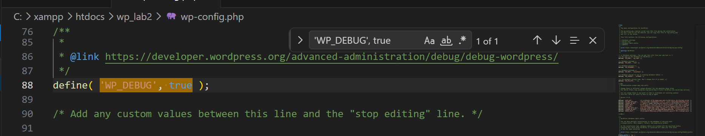

### Шаг 2. Создание основного файла плагина

1. В папке плагина создала файл `usm-notes.php`.
2. Добавила в него метаданные плагина (название, описание, версию, автора).
3. Активировала плагин в админ-панели WordPress.
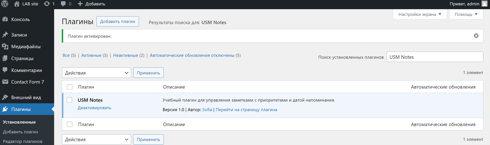

4. В результате активация прошла успешно, ошибок в админ-панели и на сайте обнаружено не было.

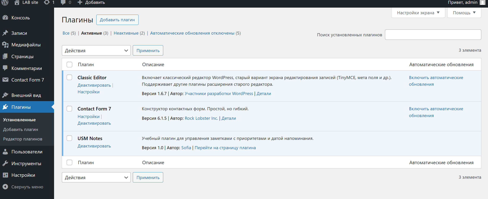

### Шаг 3. Регистрация Custom Post Type (CPT)

1. Добавила функцию для регистрации CPT «Заметки» с помощью `register_post_type()`.
2. Установила параметры CPT:
    - публичный (public),
    - поддержка заголовка, редактора, автора, миниатюры,
    - наличие архивной страницы,
    - иконка в админке.
    - метки (labels) для удобства использования.
3. Зарегистрировала CPT при инициализации WordPress с помощью хука `init`.

```php
function usm_register_notes_cpt() {
    $labels = array(
        'name'               => 'Заметки',
        'singular_name'      => 'Заметка',
        'add_new'            => 'Добавить новую',
        'add_new_item'       => 'Добавить заметку',
        'edit_item'          => 'Редактировать заметку',
        'new_item'           => 'Новая заметка',
        'view_item'          => 'Просмотреть заметку',
        'search_items'       => 'Искать заметки',
        'not_found'          => 'Заметки не найдены',
        'not_found_in_trash' => 'В корзине заметок нет',
        'menu_name'          => 'Заметки',
    );

    $args = array(
        'labels'       => $labels,
        'public'       => true,
        'supports'     => array('title', 'editor', 'author', 'thumbnail'),
        'has_archive'  => true,
        'menu_icon'    => 'dashicons-edit-page',
        'show_in_rest' => true,
    );

    register_post_type('usm_note', $args);
}

add_action('init', 'usm_register_notes_cpt');
```

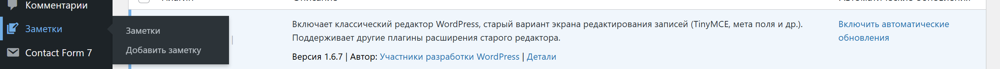

В результате, в боковом меню появились `Заментки` с выпадающим меню, дающим возмозмошность перейти на все имеющиеся заметки или добавить новую.

### Шаг 4. Регистрация пользовательской таксономии

1. Добавила функцию для регистрации таксономии «Приоритет» (Priority) с помощью `register_taxonomy()`.
2. Связала таксономию с CPT «Заметки».
3. Установила параметры таксономии:
    - иерархическая (как категории),
    - публичная,
    - метки (labels) для удобства использования.
4. Зарегистрировала таксономию при инициализации WordPress с помощью хука `init`.

```php
function usm_register_priority_taxonomy() {
    $labels = array(
        'name'              => 'Приоритеты',
        'singular_name'     => 'Приоритет',
        'search_items'      => 'Искать приоритет',
        'all_items'         => 'Все приоритеты',
        'parent_item'       => 'Родительский приоритет',
        'parent_item_colon' => 'Родительский приоритет:',
        'edit_item'         => 'Редактировать приоритет',
        'update_item'       => 'Обновить приоритет',
        'add_new_item'      => 'Добавить новый приоритет',
        'new_item_name'     => 'Название нового приоритета',
        'menu_name'         => 'Приоритет',
    );

    $args = array(
        'hierarchical'      => true,
        'labels'            => $labels,
        'public'            => true,
        'show_admin_column' => true,
        'show_in_rest'      => true,
    );

    register_taxonomy('priority', array('usm_note'), $args);
}
add_action('init', 'usm_register_priority_taxonomy');
```
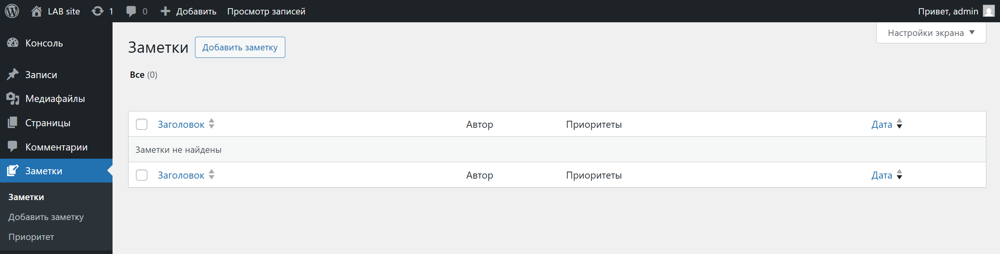
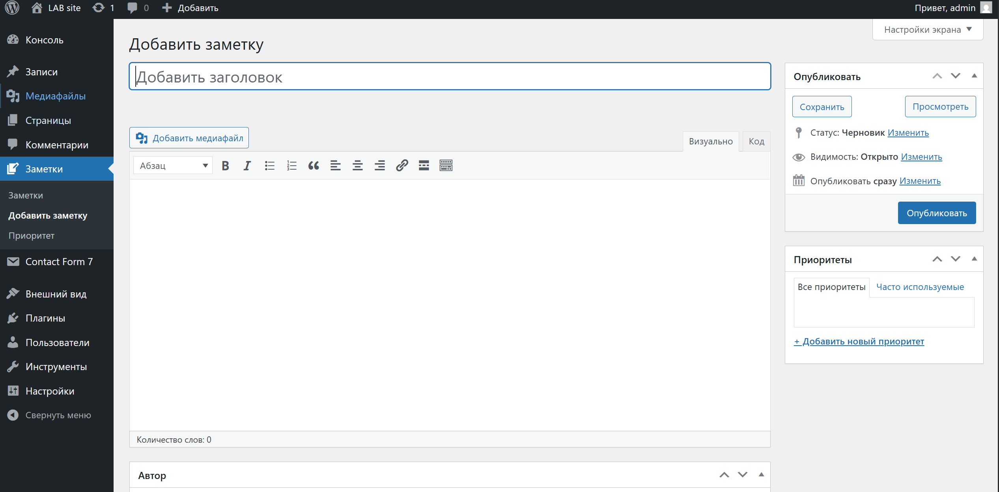

Как видно на данном этапе в выподающем меню появился еще один пункт `приоритет`, который можно выбрать при добавлении записи, просмотре всех ну и конечно просто добавить сами приоритеты.

### Шаг 5. Добавление метабокса для даты напоминания

1. Создала функцию для добавления метабокса в редактор CPT «Заметки» с помощью `add_meta_box()`.
2. В метабоксе добавила поле для выбора даты напоминания (использовала HTML5 input type="date").
```php
function usm_add_due_date_metabox() {
    add_meta_box(
        'usm_due_date',
        'Дата напоминания',
        'usm_due_date_metabox_callback',
        'usm_note',
        'side',
        'default'
    );
}
add_action('add_meta_boxes', 'usm_add_due_date_metabox');
```
3. Создала функцию для сохранения значения даты при сохранении записи с помощью хука `save_post`.

```php
function usm_save_due_date($post_id) {
    ...
}
add_action('save_post', 'usm_save_due_date');
```
4. Убедилась, что дата сохраняется корректно и отображается при редактировании записи.
5. Добавила проверку `nonce` для безопасности при сохранении метаданных.

создание nonce в форме:
```php
wp_nonce_field('usm_save_due_date', 'usm_due_date_nonce');
```

проверка nonce при сохранении:
```php
if (!isset($_POST['usm_due_date_nonce']) || !wp_verify_nonce($_POST['usm_due_date_nonce'], 'usm_save_due_date')) {
    return;
}
```

Для обеспечения безопасности при сохранении метаданных была реализована проверка `nonce`. В форме метабокса используется функция `wp_nonce_field()`, а при сохранении записи выполняется проверка с помощью `wp_verify_nonce()`. Это предотвращает возможность несанкционированной отправки данных.

6. Сделала поле даты обязательным для заполнения.

на уровне HTML:
```html
<input type="date" ... required>
```
на серверной стороне:

```php
if (!isset($_POST['usm_due_date_field']) || empty($_POST['usm_due_date_field'])) {
    $has_error = true;
    $error_message = 'Дата напоминания обязательна для заполнения.';
}
```

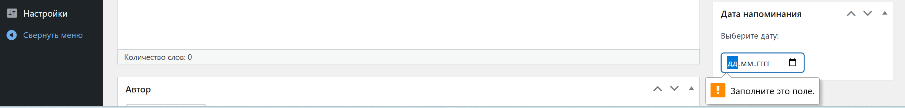


7. Добавила валидацию даты (например, дата не может быть в прошлом). В случае ошибки сохранения, выведите сообщение об ошибке.

проверка формата даты:
```php
$date_obj = DateTime::createFromFormat('Y-m-d', $due_date);
if (!$date_obj || $date_obj->format('Y-m-d') !== $due_date) {
    $has_error = true;
    $error_message = 'Некорректный формат даты.';
}
```

проверка, что дата не в прошлом:

```php
if (!$has_error && $due_date < $today) {
    $has_error = true;
    $error_message = 'Дата напоминания не может быть в прошлом.';
}
```
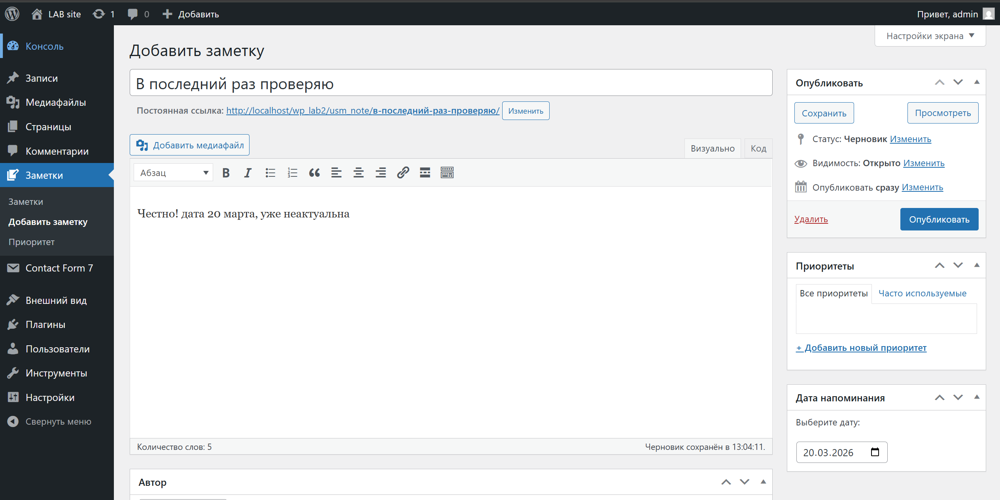
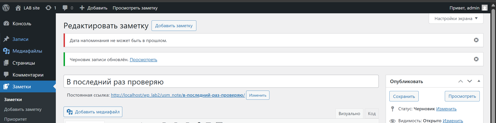

Здесь попытка добавить запись с вчерашней датой,
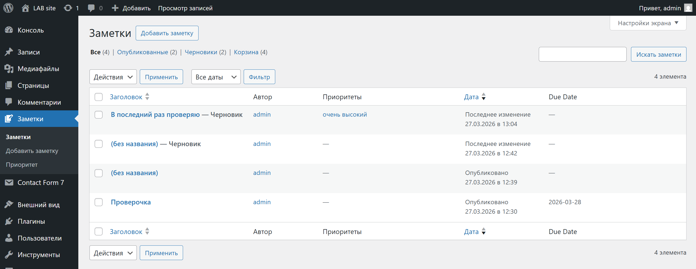

Сообщение выводится, запись сохраняется как черновик, но никто кроме админа по предпросмотру ее не видит
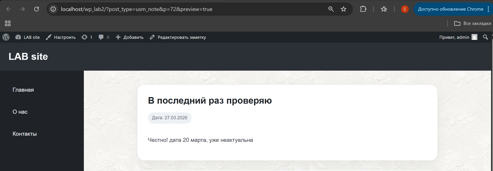

Но заходя по постоянной ссылке, такой записи нет
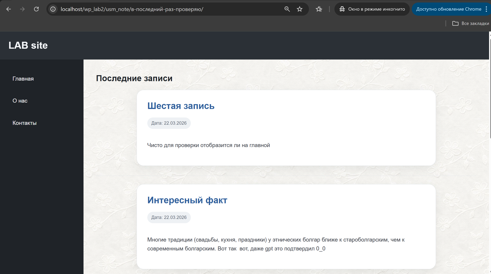

8. Отобразила дату напоминания в списке записей CPT «Заметки» в админке.

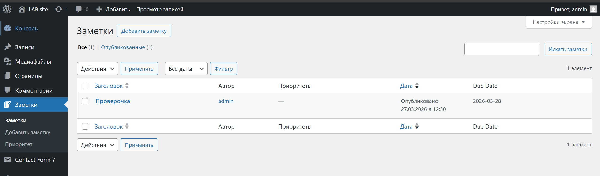
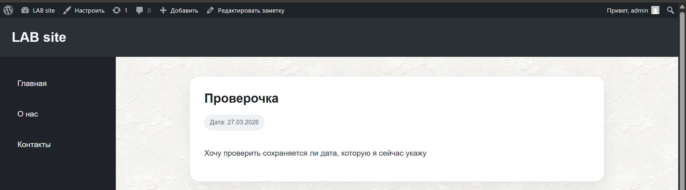

Была проведена проверка корректности сохранения даты напоминания. После ввода значения и сохранения записи дата успешно сохраняется в базе данных и корректно отображается при повторном открытии записи для редактирования.


### Шаг 6. Создание шорткода для отображения заметок

1. Создала функцию для обработки шорткода `[usm_notes priority="X" before_date="YYYY-MM-DD"]`, где `priority` - фильтр по приоритету, а `before_date` - фильтр по дате напоминания.
```php
function usm_notes_shortcode($atts) {
    $atts = shortcode_atts(array(
        'priority' => '',
        'before_date' => ''
    ), $atts);
```

2. В функции получила и отобразила список заметок, соответствующих фильтрам.

фильтр по дате:
```php
if (!empty($atts['before_date'])) {
    $meta_query[] = array(
        'key' => '_usm_due_date',
        'value' => $atts['before_date'],
        'compare' => '<=',
        'type' => 'DATE'
    );
}
```

фильтр по приоритету:
```php
if (!empty($atts['priority'])) {
    $tax_query[] = array(
        'taxonomy' => 'priority',
        'field' => 'slug',
        'terms' => sanitize_title($atts['priority'])
    );
}
```
3. Зарегистрировала шорткод с помощью `add_shortcode()`.

```php
add_shortcode('usm_notes', 'usm_notes_shortcode');
```

4. Добавила стили для оформления списка заметок.

```php
function usm_notes_styles() {
    echo '<style>
        .usm-notes {
            display: flex;
            flex-direction: column;
            gap: 20px;
        }
        .usm-note {
            padding: 20px;
            border-radius: 15px;
            background: #f5f5f5;
        }
        .usm-note h3 {
            margin-bottom: 10px;
        }
    </style>';
}
add_action('wp_head', 'usm_notes_styles');
```
5. Обработала случаи, когда нет заметок, соответствующих фильтрам, и вывела соответствующее сообщение: "Нет заметок с заданными параметрами".

```php
} else {
    $output = '<p>Нет заметок с заданными параметрами</p>';
}
```
[usm_notes priority="net-takogo"]
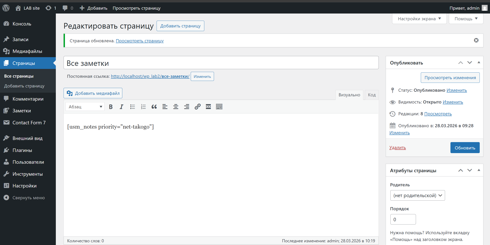
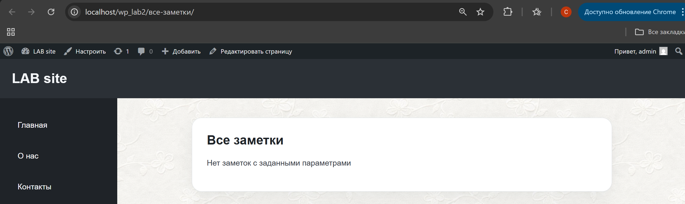

6. Если `priority` или `before_date` не указаны, шорткод отображает все заметки.


### Шаг 7. Тестирование плагина

1. Добавила 5 заметок с разными приоритетами и датами напоминания.
2. Присвоила каждой приоритет и заполнила «Due Date».
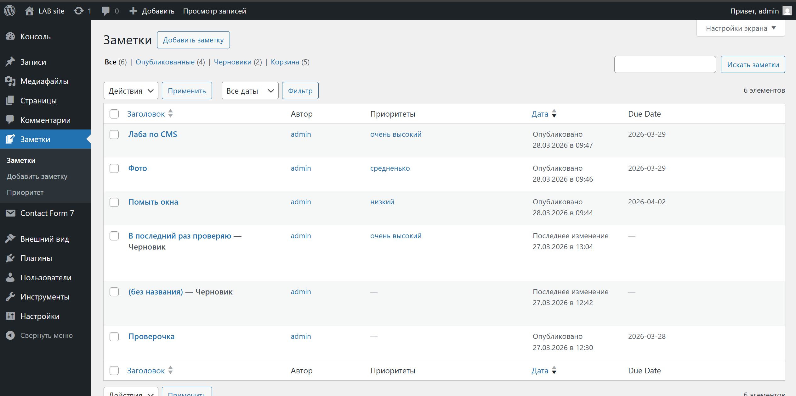
3. Создала страницу «All Notes» и вставьте шорткод:
   1. `[usm_notes]` - для отображения всех заметок.
   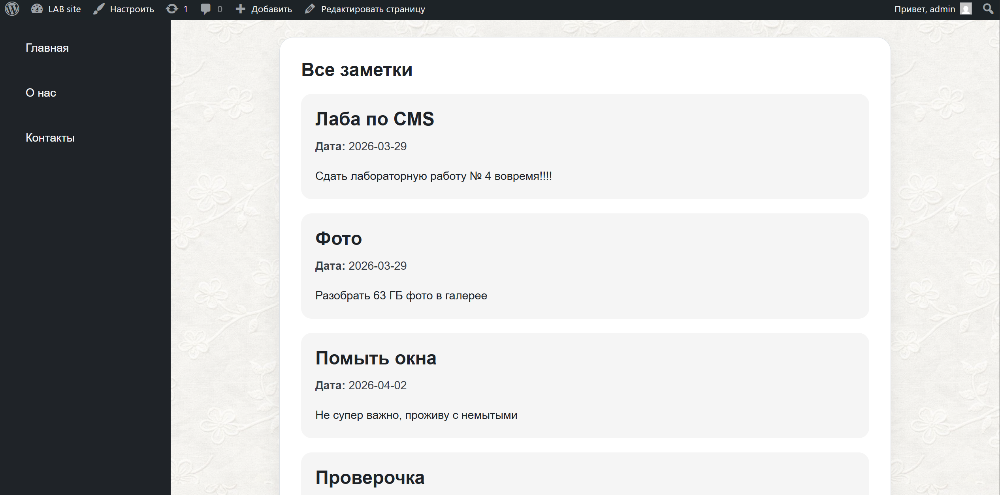
   
   2. `[usm_notes priority="очень-высокий"]` - для отображения заметок с высоким приоритетом.
   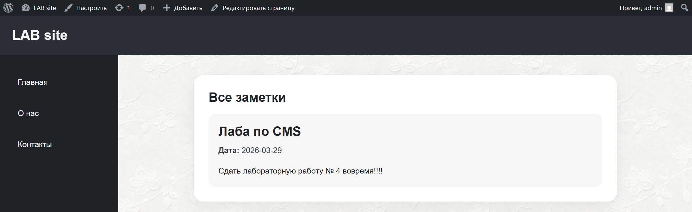
   [usm_notes priority="средненько"]
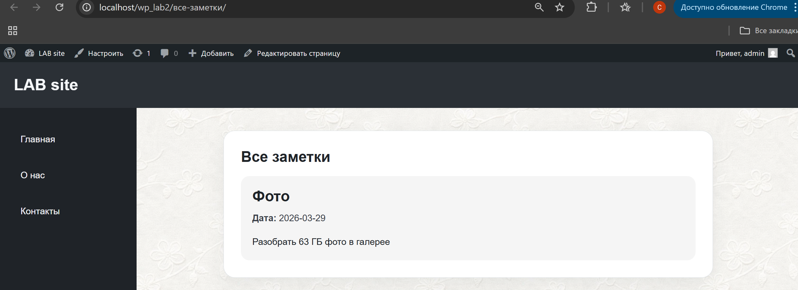

   3. `[usm_notes before_date="2026-04-30"]` - для отображения заметок с датой напоминания до 30 апреля 2026 года.
   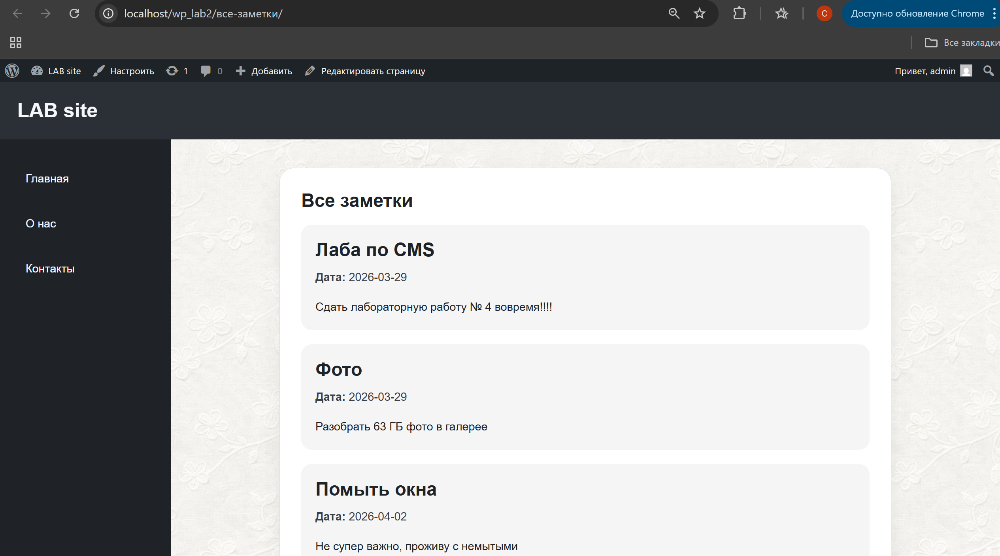
   [usm_notes before_date="2026-03-28"]
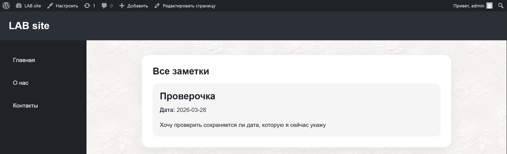

## Контрольные вопросы

**1. Чем пользовательская таксономия принципиально отличается от метаполя? Приведи пример, когда выбрать таксономию, а когда - метаданные**

Пользовательская таксономия используется для группировки и классификации записей (например, категории или теги). Она позволяет объединять записи по общим признакам и удобно фильтровать их.

Метаполе — это дополнительное поле, привязанное к конкретной записи, которое хранит уникальные данные (например, дата, цена, статус).

Таксономию выбирают, когда нужно группировать записи (например, приоритет: high/medium/low).
Метаполя используют, когда данные индивидуальны для каждой записи (например, дата напоминания).

**2. Зачем нужен `nonce` при сохранении метаполей и что произойдёт, если его не проверять?**

Nonce используется для защиты от несанкционированных запросов (например, CSRF-атак). Он подтверждает, что действие выполнено из административной панели WordPress и текущим пользователем.

Если не проверять nonce, злоумышленник может отправить поддельный запрос и изменить данные записи без ведома пользователя.

**3. Какие аргументы `register_post_type()` и `register_taxonomy()` чаще всего важны для фронтенда и UX (назови минимум три и объясни почему).**

1. public — определяет, доступен ли тип записи или таксономия на сайте. Влияет на отображение на фронтенде.

2. supports — задаёт, какие поля доступны (заголовок, редактор, миниатюра). Важно для удобства работы с записями.

3. has_archive — включает архивную страницу для типа записей, что важно для отображения списка записей на сайте.

4. labels — отвечает за названия элементов в админке, улучшает UX и делает интерфейс понятным.

5. rewrite — управляет URL-структурой (человекопонятные ссылки), что важно для SEO и удобства пользователей.

## Вывод

В ходе лабораторной работы был разработан пользовательский плагин для WordPress, позволяющий создавать и управлять заметками с указанием приоритета и даты напоминания.

Были реализованы пользовательский тип записей (CPT), таксономия «Приоритет», метаполе для хранения даты, а также механизмы валидации и защиты данных с использованием nonce. Дополнительно был создан шорткод для вывода заметок на сайте с возможностью фильтрации по приоритету и дате.

В результате работы был получен полнофункциональный плагин, обеспечивающий удобное управление заметками и их отображение на сайте, что подтверждает успешное достижение цели лабораторной работы.

## Список использованных источников

1. Лучший курс по WordPress
    https://github.com/MSU-Courses/content-management-systems/tree/main

2. WordPress Developer Resources — Plugins.  
   https://developer.wordpress.org/plugins/

3. register_post_type() — WordPress Developer Documentation.  
   https://developer.wordpress.org/reference/functions/register_post_type/

4. Shortcode API — WordPress Developer Documentation.  
   https://developer.wordpress.org/plugins/shortcodes/

5. WordPress Support Forum.  
   https://wordpress.org/support/