# Лабораторная работа №5. Безопасность WordPress

 - **Калинкова София, I2302** 
 - **02.04.2026** 

## Цель работы

Закрепить ключевые практики безопасности WordPress: управление ролями и паролями, обновления, базовое hardening (wp-config.php, права, отключение редактора), резервное копирование, мониторинг активности и поэтапная настройка All In One WP Security & Firewall (AIOS) для защиты от брутфорса, базового WAF и контроля прав.

## Условие

### Шаг 1. Подготовка среды

1. В локальной установке WordPress перешла в админ-панель.
2. Убедилась, что у есть доступ администратора.
3. Включила отладку в `wp-config.php`, установив `define('WP_DEBUG', true);`.

### Шаг 2. Управление ролями и паролями

1. Создала тестового пользователя c ролью Автор (для дальнейших проверок).

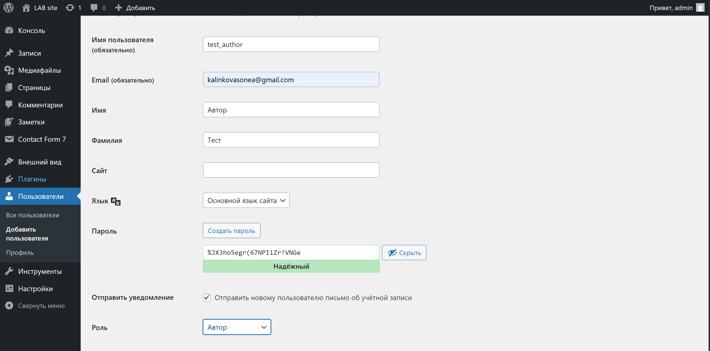

2. Проверила, что у каждого администратора включены сложные пароли.


### Шаг 3. Обновления ядра, тем и плагинов

1. Проверила наличие обновлений для WordPress, тем и плагинов. (было одно)

2. Обновила темы до последних версий.
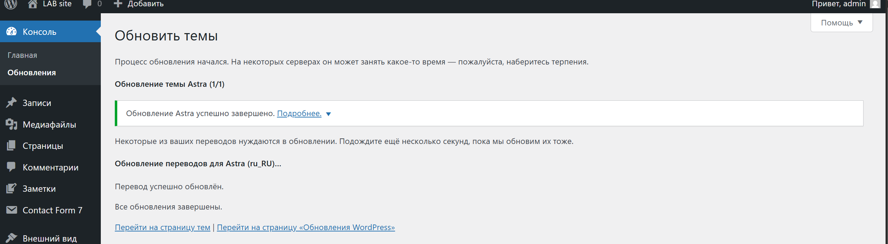

3. Настроила автоматические обновления для тем и плагинов (в списке со всеми просто нажала включить автоматические обновления).

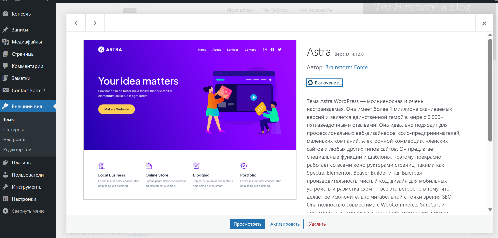


4. Проверила, что все обновления прошли успешно и сайт работает корректно.


### Шаг 4. Базовое hardening

1. Запретила редактирование файлов из админки, добавив в `wp-config.php`:
   ```php
   define('DISALLOW_FILE_EDIT', true);
   ```

Из бокового меню пропал пункт "Редактор файлов".

2. Попытка настроить верные права на файлы и папки:
   - Папки: `755`
   - Файлы: `644`


3. Защитила `wp-config.php`, добавив в `.htaccess`:
   ```
   <files wp-config.php>
       order allow,deny
       deny from all
   </files>
   ```


Теперь при попытке открыть в браузере:

http://localhost/wp_lab2/wp-config.php


### Шаг 5. Установка и первичная настройка All In One WP Security & Firewall (AIOS)

1. Установила и активировала плагин `All In One WP Security & Firewall`.

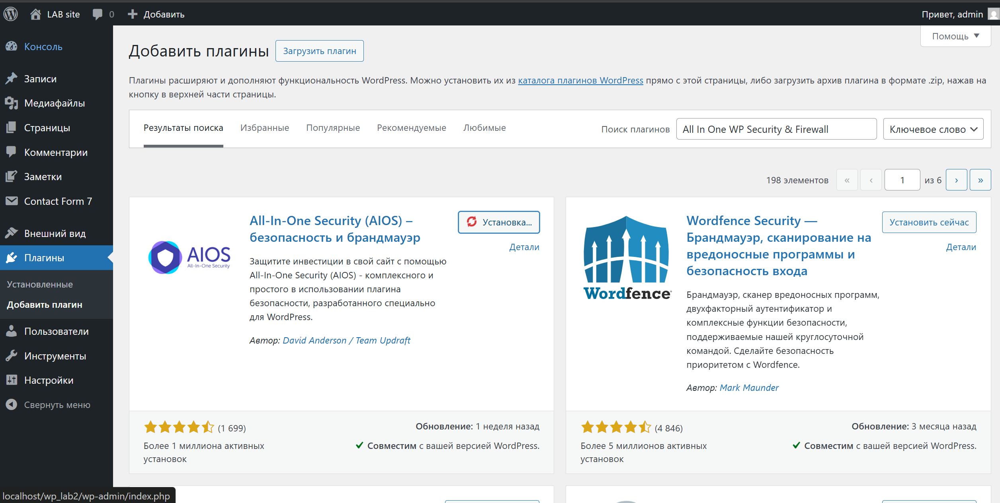

2. Перешла в раздел плагина в админ-панели.
3. Настроила следующие параметры:
   1. *User Login*:
      * Включила *Login Lockdown*.
        - *Max Login Attempts*: `5`, 
        - *Login Retry Time Period*: `15` мин, 
        - *Lockout Time*: `30` мин.
        
        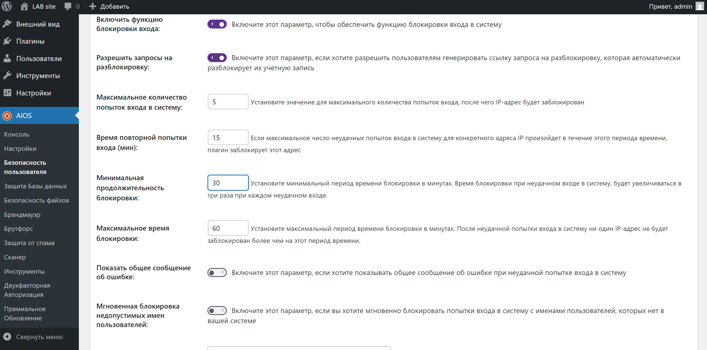

      * Включила *Force Logout* (24 ч), чтобы ограничить "вечные" сессии.
      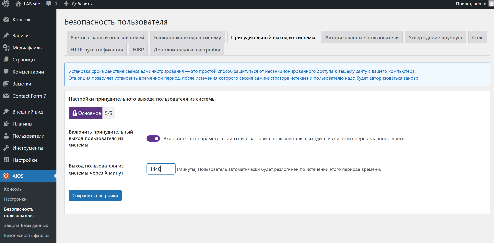

   2. *User Accounts*:
      * Для начала пользователя с логином `admin` переименовала через AIOS в безопасный логин.
      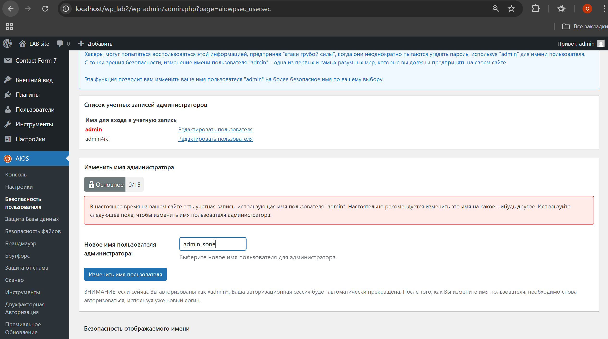

   3. *User Registration*:
      * Включила ручное одобрение новых пользователей, если регистрация открыта.
      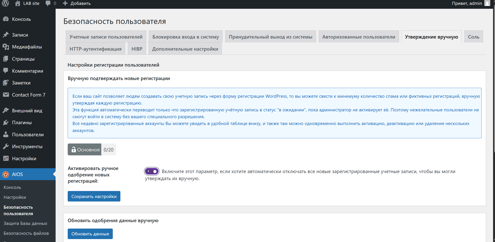

   4. *Filesystem Security*:
      * Попытка запустить проверку *File Permissions* и применила рекомендованные исправления (не делайте мирозаписываемых прав).
      

        Однако плагин определил, что сайт работает на сервере под управлением Windows, в связи с чем данная функция недоступна.

        Это связано с тем, что в операционной системе Windows используется иная модель управления правами доступа (ACL), отличающаяся от стандартной системы прав Linux (chmod).


   5. *Firewall*:
      * Активировала *Basic Firewall*.
      

      * Включила защиту от *Bad Query Strings*, *XSS*, *directory browsing*.
      
      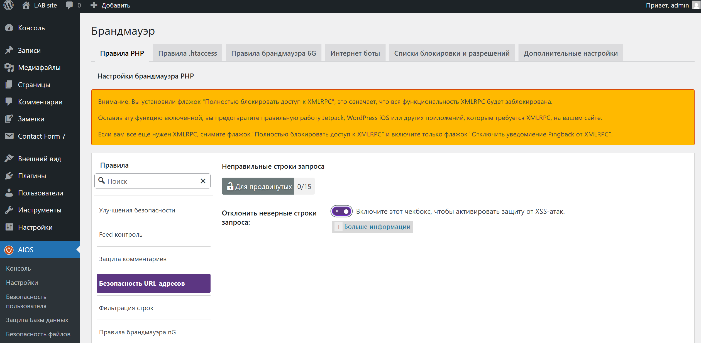
      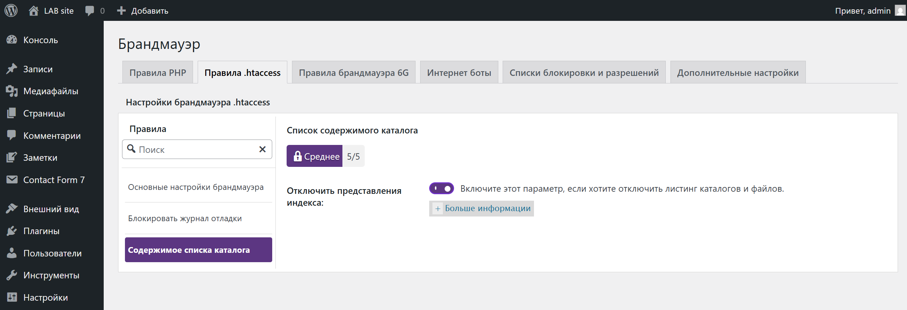
      

   6. *Brute Force*:
      * Включила *Rename Login Page* (измените URL входа с `/wp-login.php` на нестандартный, например `/login-<slug>`).
        Сохраните новый URL в менеджер паролей!

        http://localhost/wp_lab2/login-secure-123
        http://localhost/wp_lab2/my-login-777
        
   7. *Scanner / Malware*:
      * Настройте *file change detection* (уведомления на почту).

      
      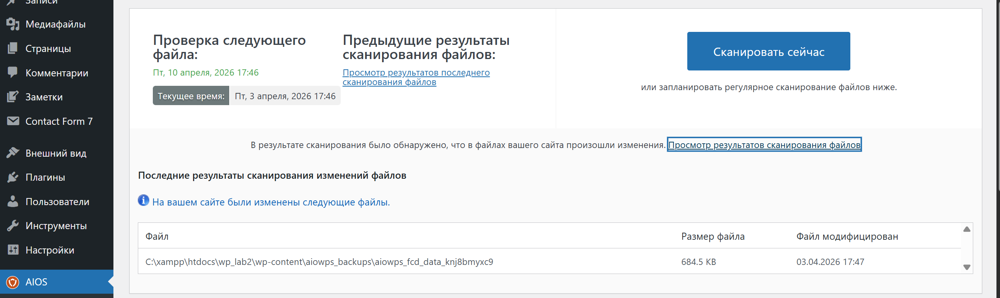
   8.  *Backup*:
       * В секции Database создайте *резервную копию БД* (храните вне веб-корня). Настройте расписание, если доступно.
       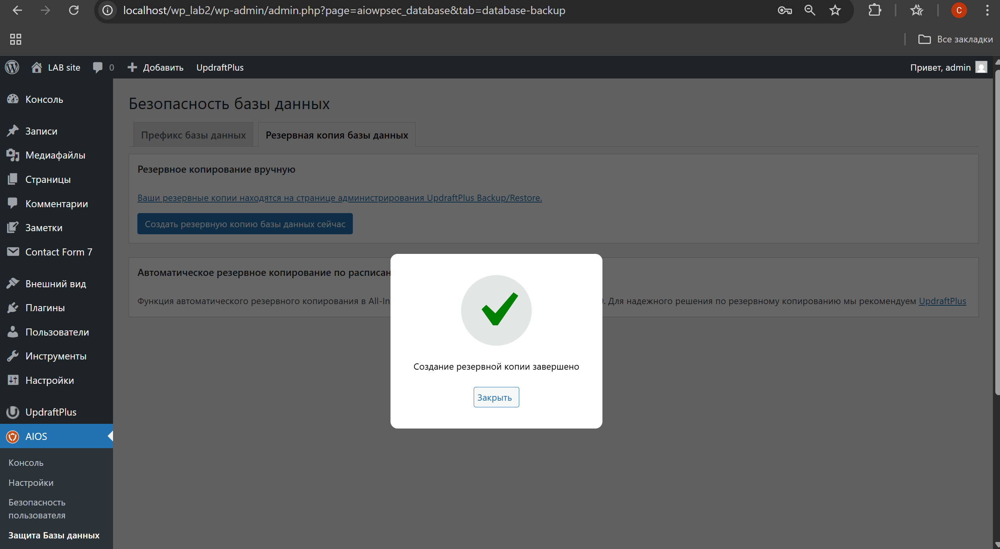
       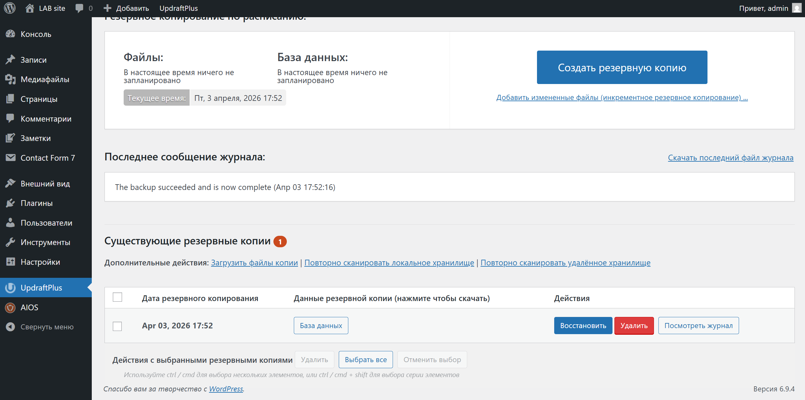
   9.  *Notifications*:
       * Включите email-уведомления для важных событий (например, lockout, новый администратор, изменение файлов).
  
### Шаг 6. Проверка защиты от брутфорса (на тестовом пользователе)

1. Выйдите из админки (или используйте приватное окно).
2. Перейдите на *новый URL входа*, попробуйте ввести неправильный пароль 5–6 раз.
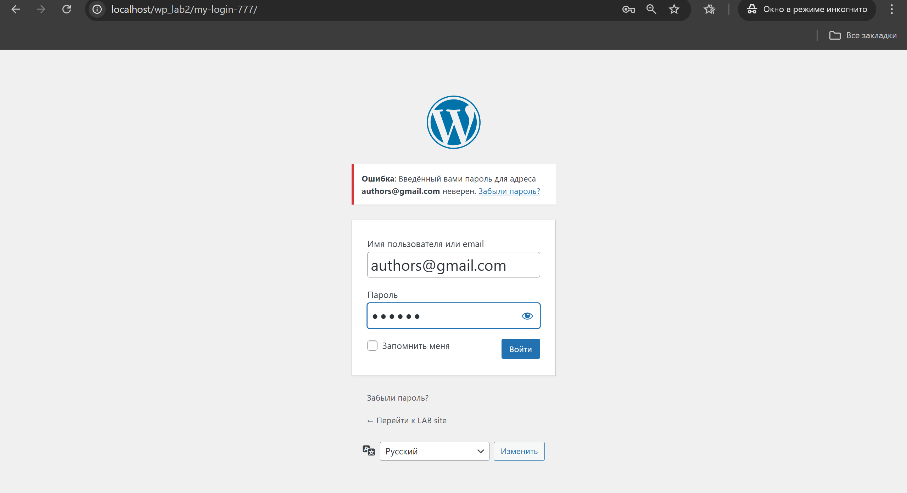
3. Убедитесь, что сработал *Lockdown* (блокировка IP/пользователя).
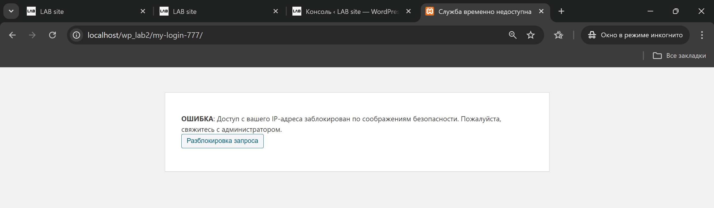
4. Посмотрите запись о блокировке в *WP Security → Dashboard / Logs* и (по необходимости) разблокируйте тестовый IP.


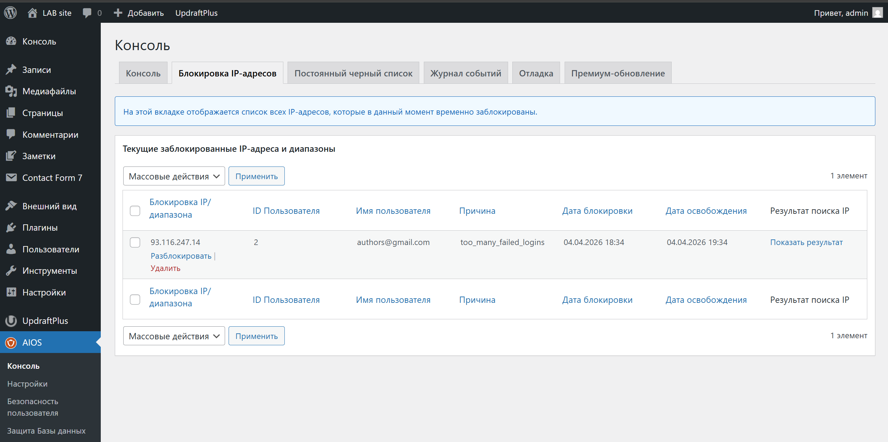


### Шаг 7. Восстановление из резервной копии

1. Удалите тестовую запись и одно произвольное изображение.

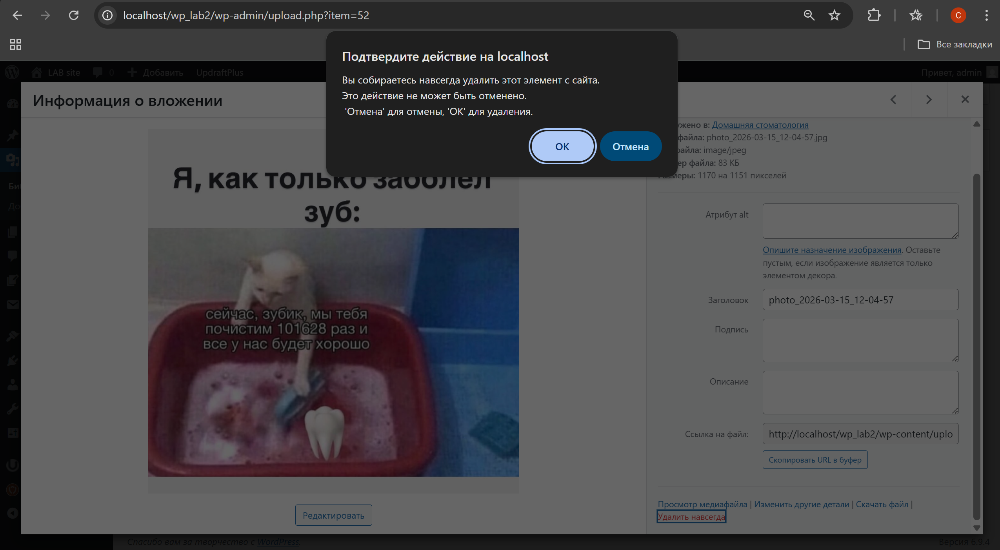
2. Восстановите *БД* из бэкапа (импорт SQL или через плагин).

3. Проверьте целостность данных (восстановлено ли удалённое изображение и тестовая запись).
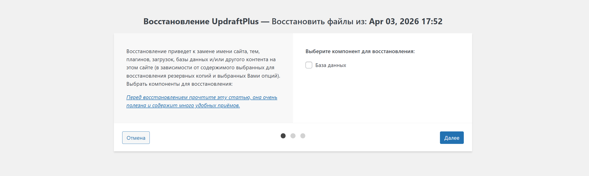
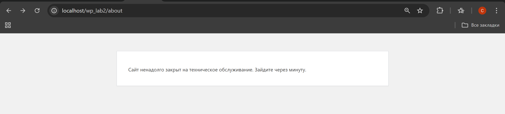
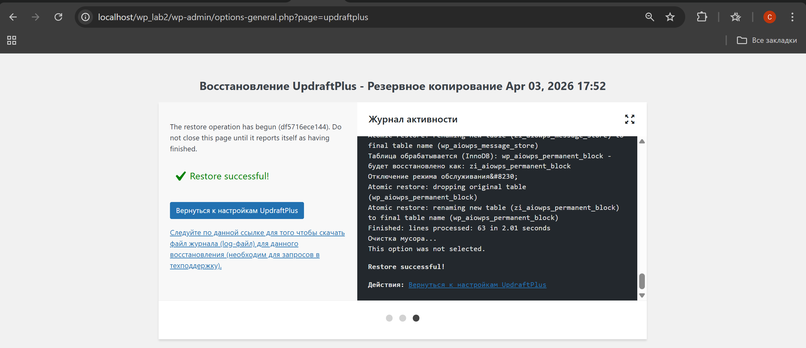

дааа вернулась 

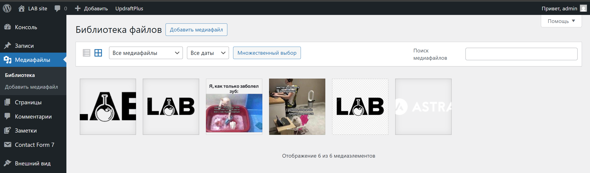


## Контрольные вопросы

1. Почему `DISALLOW_FILE_EDIT` и правильные права на `wp-config.php` существенно уменьшают риск пост-эксплойта?
2. Какие параметры Login Lockdown/Firewall вы выбрали и почему именно такие (обоснуйте баланс безопасности и UX)?
3. Чем отличаются меры защиты на уровне WordPress (плагин/WAF) от мер на уровне веб-сервера и ОС?
4. Что обязательно включать в "полный" бэкап WP и как вы проверяете, что восстановление действительно работает?


