# Лабораторная работа №5. Безопасность WordPress

 - **Калинкова София, I2302** 
 - **02.04.2026** 

## Цель работы

Закрепить ключевые практики безопасности WordPress: управление ролями и паролями, обновления, базовое hardening (wp-config.php, права, отключение редактора), резервное копирование, мониторинг активности и поэтапная настройка All In One WP Security & Firewall (AIOS) для защиты от брутфорса, базового WAF и контроля прав.

## Условие

### Шаг 1. Подготовка среды

1. В локальной установке WordPress перешла в админ-панель.
2. Убедилась, что у есть доступ администратора.
3. Включила отладку в `wp-config.php`, установив `define('WP_DEBUG', true);`.

### Шаг 2. Управление ролями и паролями

1. Создала тестового пользователя c ролью Автор (для дальнейших проверок).


2. Проверила, что у каждого администратора включены сложные пароли.

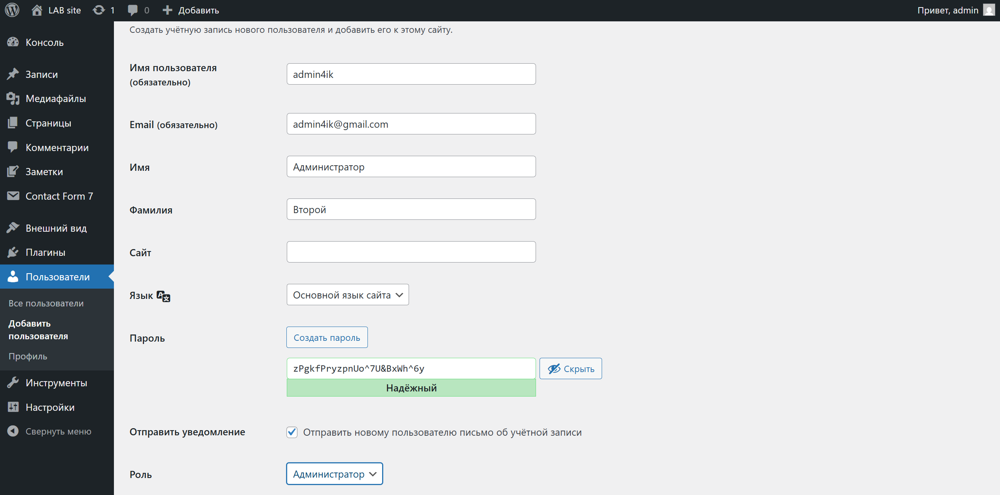

### Шаг 3. Обновления ядра, тем и плагинов

1. Проверила наличие обновлений для WordPress, тем и плагинов. (было одно)
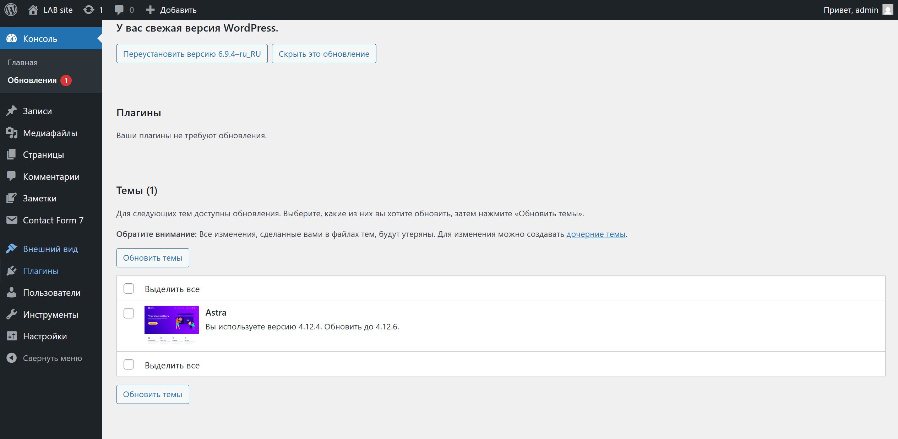
2. Обновила темы до последних версий.


3. Настроила автоматические обновления для тем и плагинов (в списке со всеми просто нажала включить автоматические обновления).
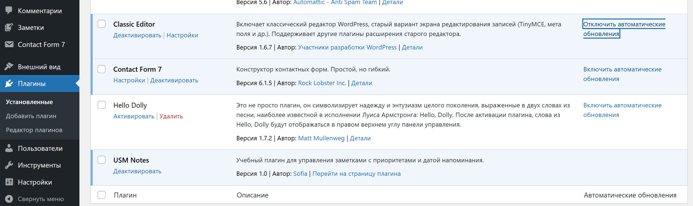

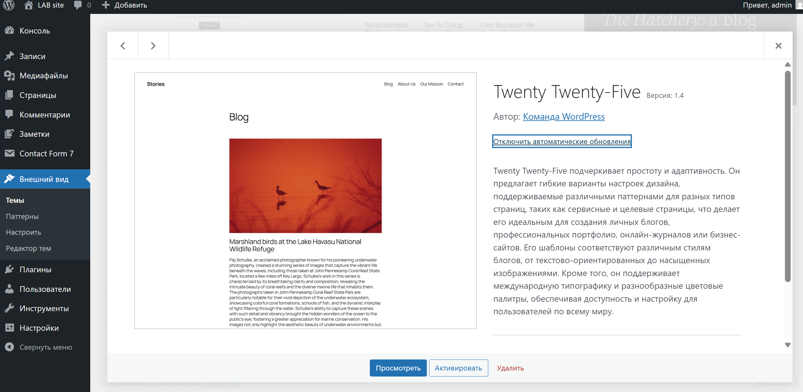

4. Проверила, что все обновления прошли успешно и сайт работает корректно.
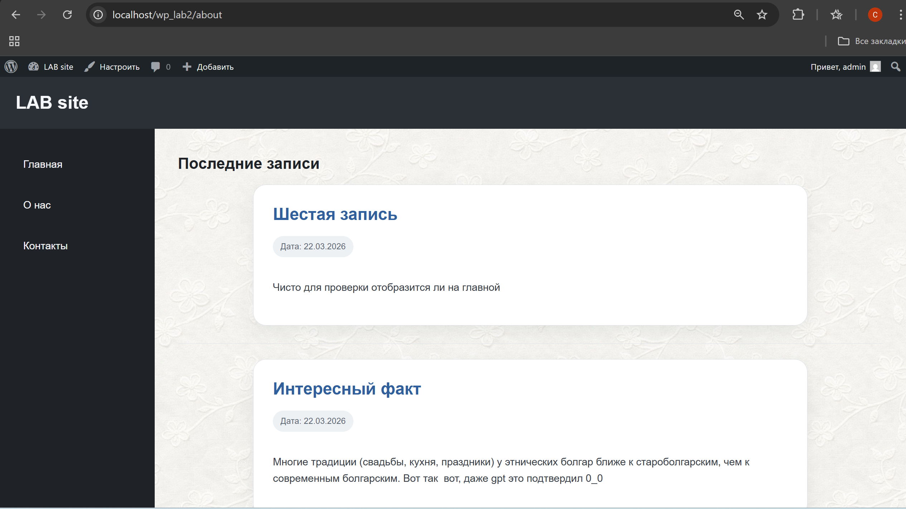

### Шаг 4. Базовое hardening

1. Запретила редактирование файлов из админки, добавив в `wp-config.php`:
   ```php
   define('DISALLOW_FILE_EDIT', true);
   ```

Из бокового меню пропал пункт "Редактор файлов".

2. Попытка настроить верные права на файлы и папки:
   - Папки: `755`
   - Файлы: `644`

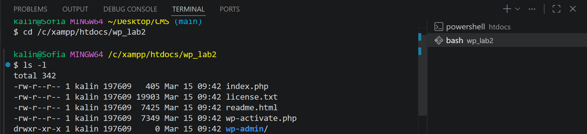
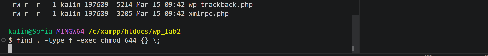

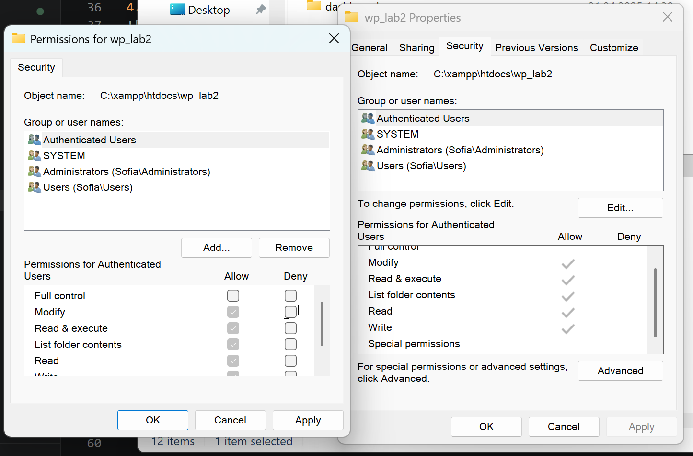

3. Защитила `wp-config.php`, добавив в `.htaccess`:
   ```
   <files wp-config.php>
       order allow,deny
       deny from all
   </files>
   ```
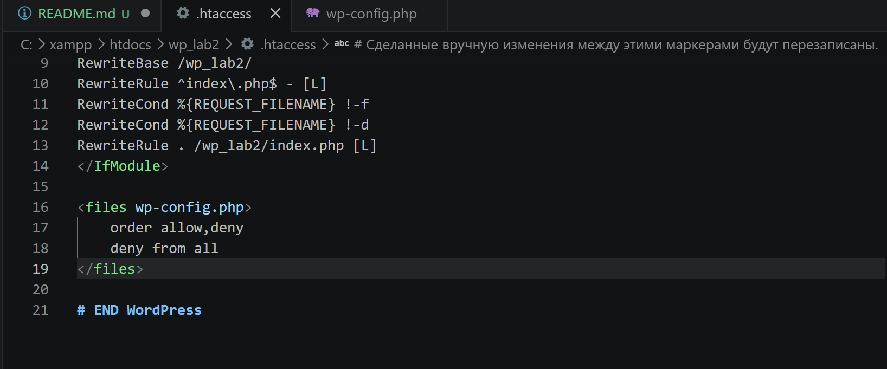

Теперь при попытке открыть в браузере:

http://localhost/wp_lab2/wp-config.php

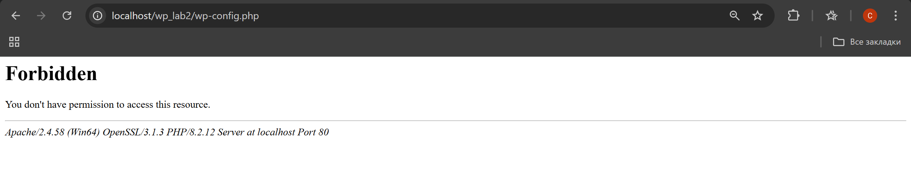

### Шаг 5. Установка и первичная настройка All In One WP Security & Firewall (AIOS)

1. Установила и активировала плагин `All In One WP Security & Firewall`.


2. Перешла в раздел плагина в админ-панели.
3. Настроила следующие параметры:
   1. *User Login*:
      * Включила *Login Lockdown*.
        - *Max Login Attempts*: `5`, 
        - *Login Retry Time Period*: `15` мин, 
        - *Lockout Time*: `30` мин.
        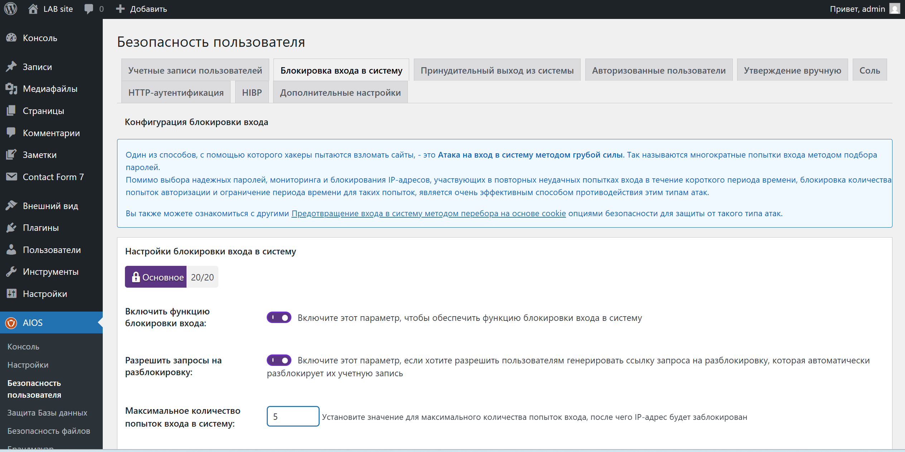
        

      * Включила *Force Logout* (24 ч), чтобы ограничить "вечные" сессии.
      

   2. *User Accounts*:
      * Для начала пользователя с логином `admin` переименовала через AIOS в безопасный логин.
      

   3. *User Registration*:
      * Включила ручное одобрение новых пользователей, если регистрация открыта.
      

   4. *Filesystem Security*:
      * Попытка запустить проверку *File Permissions* и применила рекомендованные исправления (не делайте мирозаписываемых прав).
      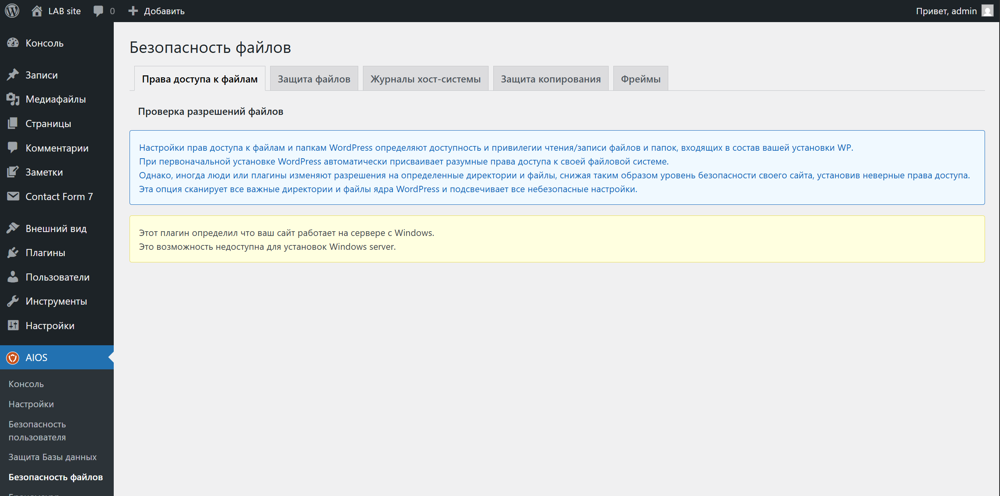

        Однако плагин определил, что сайт работает на сервере под управлением Windows, в связи с чем данная функция недоступна.

        Это связано с тем, что в операционной системе Windows используется иная модель управления правами доступа (ACL), отличающаяся от стандартной системы прав Linux (chmod).


   5. *Firewall*:
      * Активировала *Basic Firewall*.
      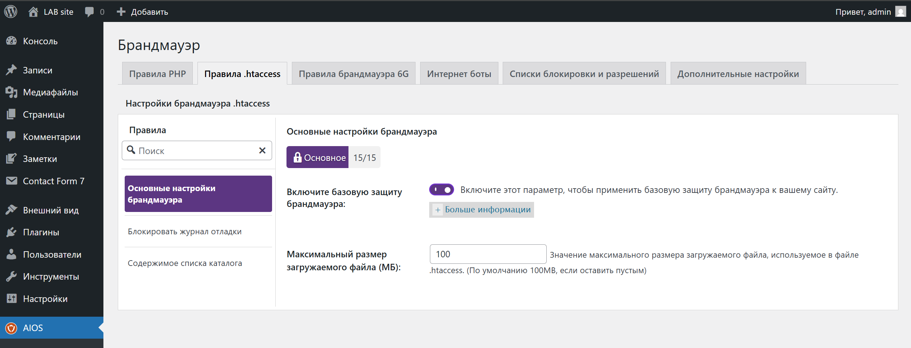

      * Включила защиту от *Bad Query Strings*, *XSS*, *directory browsing*.
      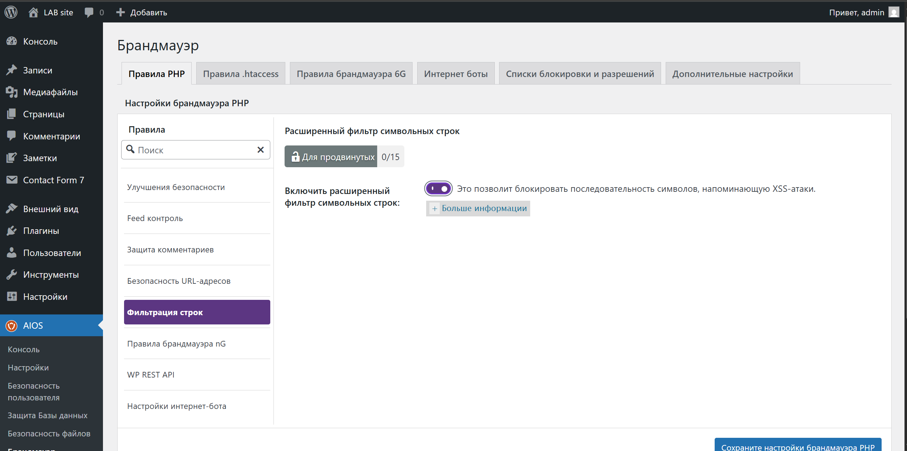
      
      
      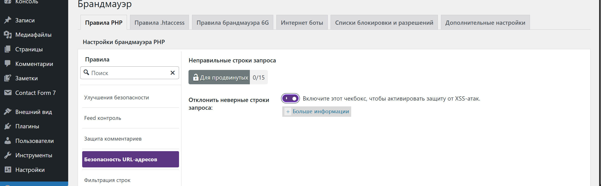

   6. *Brute Force*:
      * Включила *Rename Login Page* (изменила URL входа с `/wp-login.php` на нестандартный, например `http://localhost/wp_lab2/my-login-777`)
        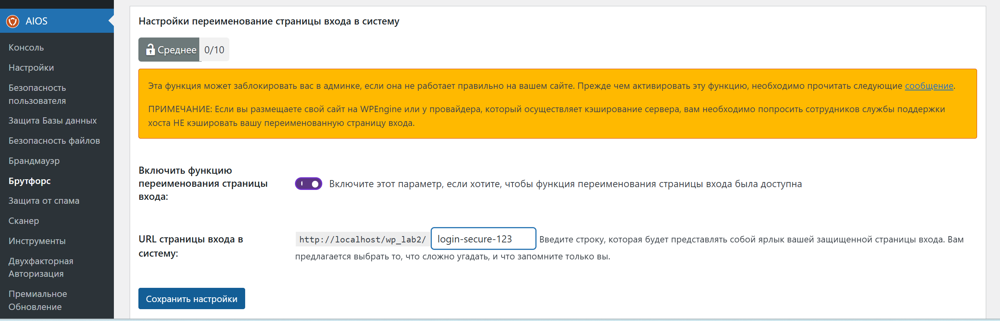
   7. *Scanner / Malware*:
      * Настроила *file change detection* (уведомления на почту).

      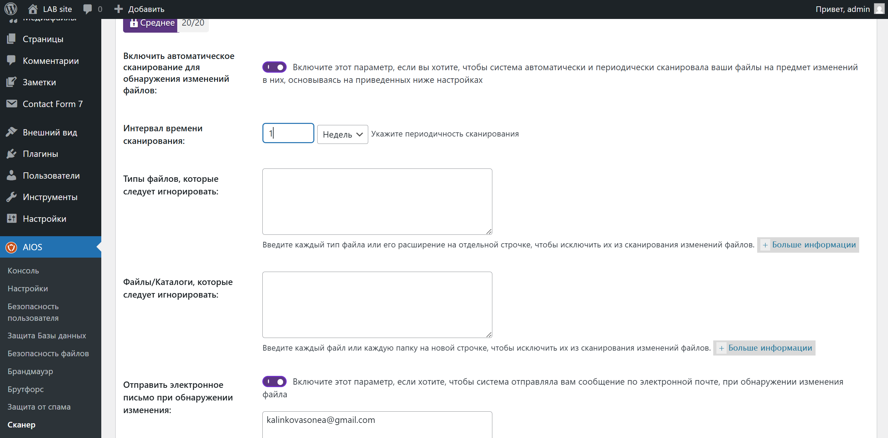
      

   8.  *Backup*:
       * В секции Database создала *резервную копию БД*.
       
       
  
### Шаг 6. Проверка защиты от брутфорса (на тестовом пользователе)

1. Вышла из админки.
2. Перешла на *новый URL входа*, попробовала ввести неправильный пароль 5–6 раз.

3. Убедилась, что сработал *Lockdown* (блокировка IP/пользователя).

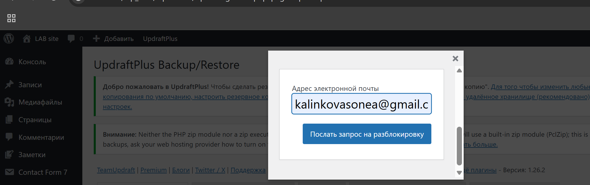

4. Посмотрела запись о блокировке в *WP Security → Dashboard / Logs* и разблокировала тестовый IP.


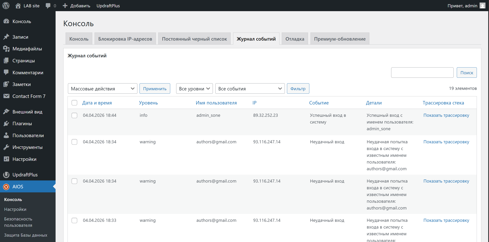

### Шаг 7. Восстановление из резервной копии

1. Удалила тестовую запись и одно произвольное изображение.
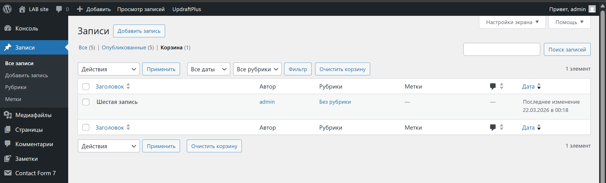


2. Восстановила *БД* из бэкапа (импорт SQL или через плагин).
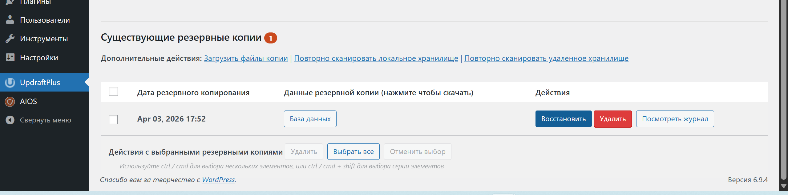

3. Проверила целостность данных (восстановлено удалённое изображение и тестовая запись).


дааа вернулись!!
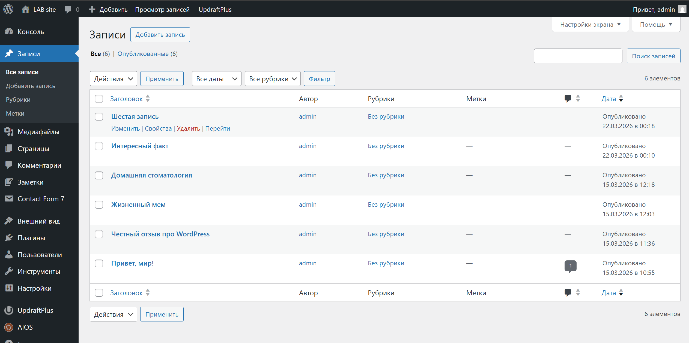


## Контрольные вопросы

### 1. Почему `DISALLOW_FILE_EDIT` и права на `wp-config.php` важны?

`DISALLOW_FILE_EDIT` отключает встроенный редактор файлов в админке, поэтому даже при взломе злоумышленник не сможет быстро внедрить вредоносный код через панель WordPress.
Ограниченные права на `wp-config.php` защищают критичные данные (логин/пароль БД, ключи безопасности), снижая риск их кражи или изменения. В итоге уменьшается вероятность развития атаки после первичного взлома (post-exploit).

### 2. Какие параметры Login Lockdown/Firewall выбраны и почему?

Были включены:

* ограничение попыток входа (например, 3–5 попыток),
* временная блокировка IP,
* переименование страницы входа,
* базовый firewall + защита от XSS и bad query.

Это даёт баланс:
- защита от перебора и автоматических атак
- при этом обычный пользователь не блокируется слишком быстро и может нормально войти.

### 3. Разница между защитой WP и уровнем сервера/ОС

* **WordPress (плагины, WAF)** — работает на уровне приложения: защита входа, фильтрация запросов, контроль пользователей.
* **Веб-сервер (.htaccess, nginx)** — блокирует запросы ещё до WordPress (например, запрет доступа к файлам).
* **ОС** — самый низкий уровень: права доступа, процессы, сеть.
 Чем ниже уровень — тем раньше останавливается атака.

### 4. Что входит в полный бэкап и как проверить восстановление?

Полный бэкап включает:

* базу данных (посты, пользователи, настройки),
* файлы сайта (themes, plugins, uploads).

Проверка:

1. удалить часть данных (запись/файл),
2. выполнить восстановление,
3. убедиться, что данные вернулись и сайт работает корректно.
